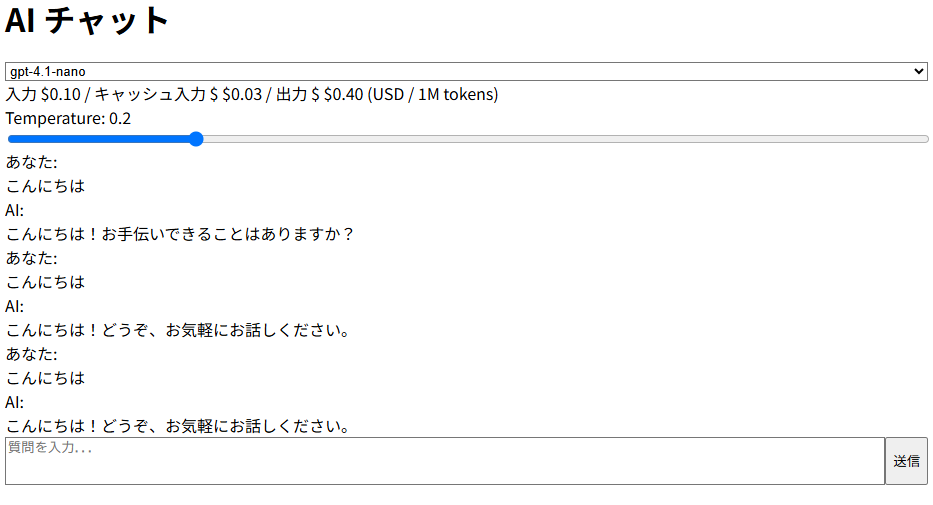

# ai-chat-webapp

[](https://github.com/nshrhm/ai-chat-webapp/actions/workflows/ci.yml)
[](https://nodejs.org/)

OpenAI の複数モデル・API を比較しながらチャット体験を検証できる Web アプリケーション。  
リアルタイムの対話 UI に加え、API 特有の機能を実装・評価できる拡張性を備え、将来的には他社の AI API も簡単に組み込める設計です。

## デモ




## Features

- シンプルなチャット UI  
- OpenAI Chat API 呼び出し  
- エラーハンドリング・再試行機能  
- TailwindCSS レスポンシブデザイン  
- Vite proxy による CORS 回避  
- モノレポ構成（client + server）
- 動的モデル選択機能（ドロップダウン）  
- モデルごとに温度パラメータの設定が可能（非対応モデルはスライダー非表示）  
- 回答は Markdown 形式でレンダリングされ、改行や書式が反映されます

## Installation

```bash
git clone https://github.com/nshrhm/ai-chat-webapp.git
cd ai-chat-webapp
pnpm install
```

## Development

```bash
pnpm dev
```

- Client: http://localhost:5173  
- Server: http://localhost:3001  

### モデル一覧フェッチ
フロントエンドは `/api/models` を呼び出し、利用可能モデルを取得してドロップダウンに表示します。

## Build

```bash
pnpm build
```

## Environment Variables

サーバー側の環境変数ファイルを作成します。

```bash
# server/.env
OPENAI_API_KEY=sk-xxxxxxxxxxxxxxxxxxxxxxxxxxxxxxxx
```

## Contributing

プルリクエスト歓迎。`feature/*`, `bugfix/*` ブランチ戦略、Conventional Commits を採用。

## OpenAI 利用料金情報

データ共有を有効にし、無料トークンの対象となる場合、利用階層に応じて以下のように表示されます。  
このオファーは設定ページに記載された日付（2025年4月30日）まで有効です。

- Tier3-5: 1日最大1,100万トークンまでの無料トークンに登録されています  
- Tier1-2: 1日最大275万トークンまでの無料トークンに登録されています  

このオファーは以下のモデルでのみご利用いただけます。  
ファインチューニングされたモデル、ファインチューニングトレーニング、Assistants APIでのoシリーズモデルの使用、およびツールの使用は含まれません。

### 1Mトークングループ（利用階層1-2では250K）

- gpt-4.5-preview-2025-02-27  
- gpt-4.1-2025-04-14  
- gpt-4o-2024-05-13  
- gpt-4o-2024-08-06  
- gpt-4o-2024-11-20  
- o3-2025-04-16  
- o1-preview-2024-09-12  
- o1-2024-12-17  

### 10Mトークングループ（利用階層1-2では2.5M）

- gpt-4.1-mini-2025-04-14  
- gpt-4.1-nano-2025-04-14  
- gpt-4o-mini-2024-07-18  
- o4-mini-2025-04-16  
- o1-mini-2024-09-12  
- o3-mini-2025-01-31  

### トークン割当量の制限はどのように機能し、いつリフレッシュされますか？

gpt-4.5-preview、gpt-4.1、gpt-4o、o1、およびo1-previewモデル間で**共有**される1日あたり最大1M（階層1-2では250k）トークン、そしてgpt-4.1-mini、gpt-4.1-nano、gpt-4o-mini、o1-mini、およびo3-miniモデル間で**共有**される1日あたり最大10M（階層1-2では2.5M）トークンが付与されます。

2025年3月6日より、トークンは毎日00:00 UTC時点でリフレッシュされます。この変更により、予測可能性と可観測性が向上しました。

各新規リクエストに対して、その日の累計に対してチェックを行います。1回のリクエストで1日の合計がトークン割当量を超える場合、そのリクエスト全体が通常料金で請求されます。

---

詳細情報は [OpenAI公式ヘルプ](https://help.openai.com/en/articles/10306912-sharing-feedback-evals-and-api-data-with-openai) をご参照ください。

## License

MIT
